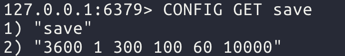
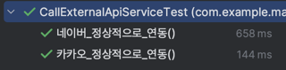
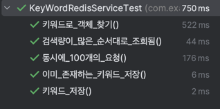
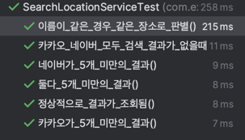

# 지도 검색 앱
## 개요 
- 장소 검색 서비스를 위한 서버 프로그램
## 기능 
1) 장소 검색
   - 외부 API를 이용하여 장소를 검색해 결과를 통합해서 보여줌
   - 외부 API는 [Kakao 로컬 API](https://developers.kakao.com/docs/latest/ko/local/dev-guide#search-by-keyword), [Naver 장소 검색 API](https://developers.naver.com/docs/serviceapi/search/local/local.md#%EC%A7%80%EC%97%AD)를 사용함 
   - 두 서비스 이외에 검색 API 제공자가 추가 될 수 있음


3) 검색 키워드 목록
    - 검색량이 많은 상위 10개의 검색어를 보여줌 
    - 키워드 별로 검색된 횟수도 함께 표기함
## 환경
- Java 17/ Spring boot 3.3.4 / Maven 
- Redis 

## 프로젝트 구조


## 사용 방법
### 1. 장소 검색 
- API 호출 예시 
  - 검색어 : 곱창
```curl
curl --location 'http://localhost:8080/v1/place?param=%EA%B3%B1%EC%B0%BD'
```
- 응답 예시 
  - 최대 10개의 응답 값을 확인할 수 있음
```json
{
    "places": [
        {
            "title": "별미곱창 본점"
        },
       ...
    ]
}
```
### 2. 검색 키워드 목록
- API 호출 예시
```curl
curl --location 'http://localhost:8080/v1/ranking'
```
- 응답 예시 
  - 최대 10개의 응답 값을 확인할 수 있음
  - keyword : 검색어, searchCount : 검색 된 횟수
```json
[
    {
        "keyword": "곱창",
        "searchCount": 5.0
    },
   ...
]
```


## 구조

- config/
  - 애플리케이션의 설정 관련 클래스 
- constant/
  - 애플리케이션에서 공통적으로 사용하는 상수값
  - 여러 곳에서 공통으로 사용하는 값들을 한 곳에서 관리하여 코드의 유지보수성 고려 
- controller/ 
  - 컨트롤러 클래스 
- domain/
  - 도메인 모델 
- dto/
  - Data Transfer Object, 데이터 전송을 위한 객체
- entity/
  - 데이터베이스의 테이블과 매핑되는 엔티티 클래스
- facade/ 
  - 유지 보수성 고려하여 여러 서비스의 기능을 통합하여 제공
  - 데이터 베이스 Lock 전략 유연하게 변경 가능 
- repository/ 
  - 레포지토리 클래스
- service/ 
  - 비즈니스 로직을 구현하는 서비스 클래스

## 외부 라이브러리 및 오픈소스 사용 
- Redisson 
  - 키워드별 검색 횟수 update 시 분산락 구현을 위해 사용
- Spring Data Redis
  - 본 예제의 특성을 고려해 Redis를 활용 하기 위해 사용
- Spring boot test
  - JUnit, Mockito 등을 활용해 테스트 코드를 작성하기 위해 사용
- Spring Dotenv
  - 외부 API 호출시 .env 파일에 저장된 환경 변수 관리를 위해 사용

## 구현
### 같은 업체 비교 기준
- 본 코드 에서는 업체명의 공백 제거해 같은 업체인지 판별함
- `Place` 클래스
```java
...
@Override
public boolean equals(Object obj) {
        if (this == obj) return true; // 동일 객체 참조
        if (obj == null || getClass() != obj.getClass()) return false; // null 체크 및 클래스 확인
        Place place = (Place) obj;
        return Objects.equals(normalize(title), normalize(place.title));
        }

@Override
public int hashCode() {
        return Objects.hash(title != null ? normalize(title): null);
        }

private String normalize(String input) {
        return input != null ? input.replaceAll("[\\s()\\[\\]{}<>\\p{Punct}]", "") : ""; // 공백 및 특수문자 제거
        }
```
- `Place` 클래스 내부에 `equals()` 와 `hashCode()` 를 오버라이드 하여 이름으로 장소의 값을 구분하도록 함.
- 초반, 위도(latitude)와 경도(longitude) 값을 다음과 같은 이유로 이름으로 변경함.
  - API 제공 업체별 위도, 경도의 오차가 존재함. (소수점 네자리 기준 약 11.1m 차이 발생)
  - 같은 위도, 경도 값인데 업체 명이 다를 경우 존재 가능.
### 장소 표시 순서
- 본 코드에서는 정렬 순서를 카카오를 기준으로 함. (카카오API의 결과에 표시되지 않은 경우 네이버API의 순서에 따름)
```java
    private static List<Place> mergeAndSortPlaces(List<Place> kakaoPlaces, List<Place> naverPlaces) {
        List<Place> both = kakaoPlaces.stream().distinct().filter(o->naverPlaces.contains(o)).collect(Collectors.toList());
        List<Place> kakaoOnly = kakaoPlaces.stream().distinct().filter(o->!both.contains(o)).collect(Collectors.toList());
        List<Place> naverOnly = naverPlaces.stream().distinct().filter(o->!both.contains(o)).collect(Collectors.toList());

        List<Place> finalResult = new ArrayList<>();
        finalResult.addAll(both);
        finalResult.addAll(kakaoOnly);
        finalResult.addAll(naverOnly);

        return finalResult;
    }
```
- 코드는 가독성을 우선 순위로 하여 작성함
  - `both` : 카카오 API 결과 와 네이버 API 결과에 모두 표시된 장소
  - `kakaoOnly` : 카카오 API 결과에서만 나온 장소
  - `naveroOnly` : 네이버 API 결과에서만 나온 장소
- `both` > `kakaoOnly` > `naveroOnly` 순서로 표시됨 

### 한 업체의 결과 값이 5개 미만일 때
- `ExternalApiResultDTO` 내에 `isEnd` 를 정이해 다음 페이지가 있는지 여부를 관리
  - 카카오 : reponse/is_end 값을 그대로 매핑 
    ```java
    @Getter
    public class KaKaoMetaData {
    @JsonProperty("is_end")
    private boolean isEnd;
    }
    ```
  - 네이버 : Total값이 현재 페이지의 갯수를 넘지 않으면 Fasle로 판단함 
  - `NaverApiServiceImpl.callPlaceInfoApi()`
      ```java
      ...
      result = new ExternalApiResultDTO(naverPlaces, REQUEST_COUNT >= body.getTotal());
      ...
    ```
- 만약, 한 업체로 부터 5개 미만의 결과를 받았을 경우 다른 업체의 다음 페이지 요청
- 최대 10개의 값을 응답값으로 줌
### 외부 API 호출 인터페이스
- 외부 API만을 호출하는 부분을 인터페이스로 작성
- 새로운 검색 API 제공자가 추가 되면 새롭게 구현체를 작성하여 구현 가능
- `CallExternalApiService`
  ```java
    public interface CallExternalApiService {
    
        HttpHeaders getAuthHeader();
        ExternalApiResultDTO callPlaceInfoApi(String param, int page);
    }
    ```
### 검색어 순위 구현
- Redis의 ZSet으로 검색량에 따른 순위 구현
- 시간 복잡도 O(log(N))
- `KeywordRedisService.getKeywordRanking`
    ```java
      public List<KeywordRankResDTO> getKeywordRanking() {
        ...
        Set<ZSetOperations.TypedTuple<Object>> keywordTuples = zSetOperations.reverseRangeWithScores(Constant.KEYWORD_SEARCH_COUNT, Constant.SEARCH_START, Constant.SEARCH_END);
        ...
    }
    ```
### 레디스 RDB 사용 
- 본 코드에서는 로컬 redis DB를 활용.
- 별도의 RDB 없이 redis RDB 기능으로 저장되도록 개발함
  - 설정은 기본 값을 사용했고, 다음과 같음 
    
  - 스냅샷은 `dump.rdb` 아래 저장됨

### update 시 동시성 이슈 고려
- 퍼사드 패키지로 분리
- Redisson의 분산 락 (RLock) 활용 함 
  ```java
  public void saveOrUpdateKeyword(KeywordEntity keywordEntity){
        RLock lock = redissonClient.getLock(keywordEntity.getId());
        try{
            boolean available = lock.tryLock(10, 1, TimeUnit.SECONDS);
            if(!available){
                log.info("RedissonLockKeywordFacade :: saveOrUpdateKeyword >>>> Lock 획득 실패");
                return;
            }
            keywordRedisService.saveOrUpdateKeyword(keywordEntity);
        } catch (InterruptedException e) {
            throw new RuntimeException(e);
        }finally {
            lock.unlock();
        }
    }
  ```

## 테스트
- 단위 테스트
  - 주요 서비스에 대해 테스트 코드 작성
    - `CallExternalApiServiceTest` : 이 경우는 특별히 연동을 확인하기 위해 작성함
    
    - `KeyWordRedisServiceTest`
    
    - `SearchLocationServiceTest` 
    
- 테스트 시나리오
  - postman을 활용해 통합 테스트 진행함
  - 장소 검색 API 호출 -> 검색 키워드 목록 API에서 검색 횟수 만큼 표시되는 지 확인 

## 향후 개선사항
### 외부 API 연동
- Client 와 협의 후 에러 코드 정의 
- 재시도 로직 추가 

### DB 구축 후 연동
- DB를 두어 장소, 키워드 등을 저장
- 캐시 전략 활용하여 현재 Redis DB를 캐시 서버로 쓰고 구축한 DB 와 연동


